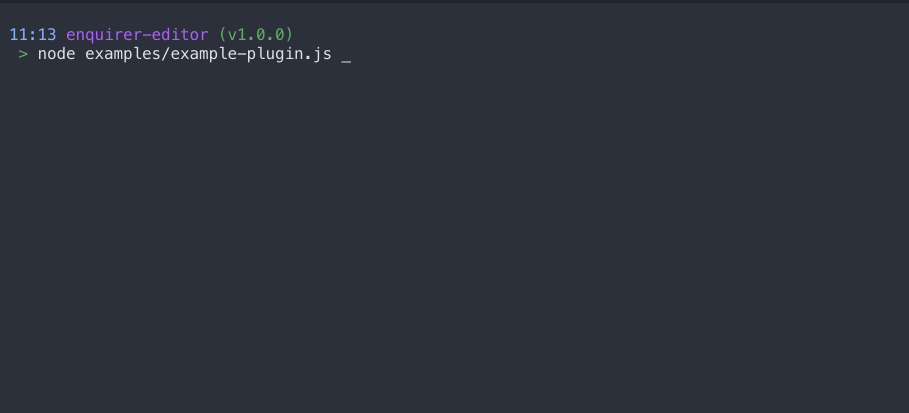

# Enquirer Editor Prompt

> A prompt built with [enquirer](https://www.npmjs.com/package/enquirer) that spawns a temporary editor utilizing the preferred editor (`$VISUAL` or `$EDITOR`); it will default to Vim or Notepad. The contents of the editor will be returned once the user saves the file.

&nbsp;

## **Install**

```
npm i enquirer-editor-prompt
```

&nbsp;

## **Demonstration**



&nbsp;

## **Usage**

There are two ways to use enquirer-editor-prompt. As a standalone prompt or as a plugin for enquirer.

&nbsp;

### **Standalone Prompt**
```javascript
// Import the prompt
const EditorPrompt = require('../index.js');

// Create a new instance of the prompt (name not required)
const prompt = new EditorPrompt({
  type: 'editor',
  message: 'Please write a short bio of at least 3 lines',
  initial: 'Start writing!',
  validate: function (response) {
    if (response.split('\n').length < 4) {
      return 'Must be at least 3 lines.';
    }
    return true;
  }
});

// Run the prompt
prompt.run()
    .then(console.log)
    .catch(console.error);

```
&nbsp;

### **Plugin Prompt**
```javascript
// Import enquirer and the editor prompt
const Enquirer = require('enquirer');
const EditorPrompt = require('../index.js');

// Create a new instance of enquirer and register the prompt
const enquirer = new Enquirer();
enquirer.register('editor', EditorPrompt);

// Create your questions (name required)
const questions = [
  {
    type: 'editor',
    name: 'bio',
    message: 'Please write a short bio of at least 3 lines',
    initial: 'Start writing!',
    validate: function (response) {
      if (response.split('\n').length < 4) {
        return 'Must be at least 3 lines.';
      }
      return true;
    },
  }
];

// Run prompt with your questions
enquirer.prompt(questions)
    .then(console.log)
    .catch(console.error);
```

